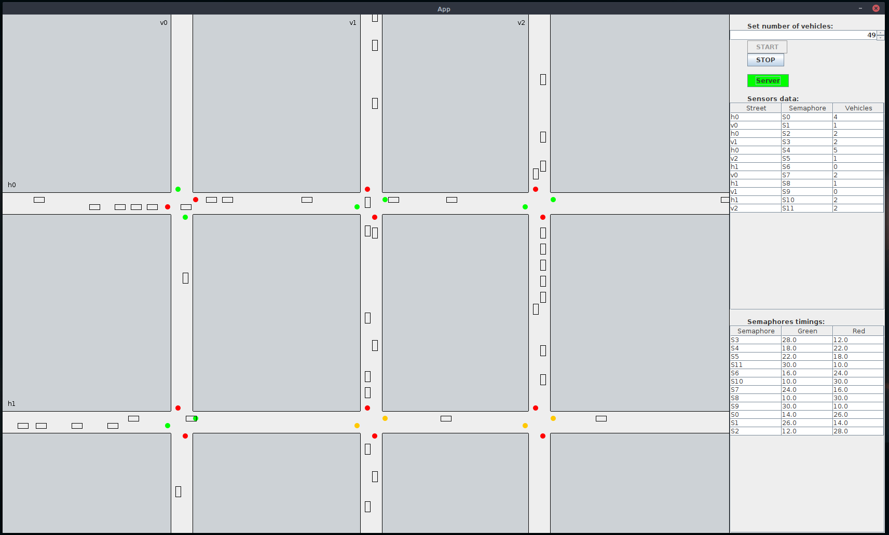
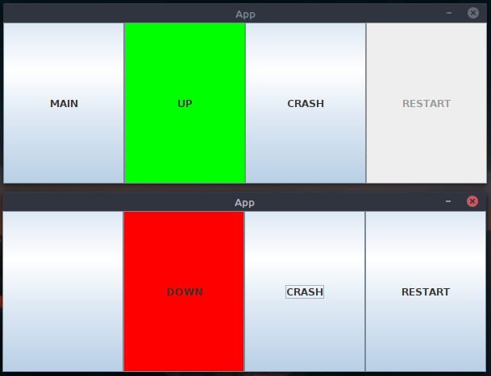

# Traffic Lights Management System

<p align="center">
  
  
  
</p>

This system is an academic project developed for the **Distributed Systems** course of the **Masters’s Degree in Computer Science and Engineering**
at the **University of Bologna**.

This project implements a distributed system for urban traffic management. It optimizes vehicle flow in small cities
through a resilient client-server architecture that adapts to real-time road conditions.
The system is built upon a **traffic simulation** that models vehicle movements and sensor detections. This simulation 
provides the data used by the distributed servers to calculate and coordinate traffic light timings.

## Project Overview
The system centralizes the control of a traffic light network. By collecting real-time data from road sensors (counting vehicles in queue),
it dynamically recalculates Green/Red light cycles to minimize waiting times and prevent congestion.

### Key Features:
- **Adaptive Management:** Dynamic calculation of traffic light timings based on actual vehicle load.
- **High Availability (Main/Backup):** Support for multiple servers with an automatic failover mechanism. If the Main server crashes, a Backup server instantly takes control.
- **Self-Assessment Policy:** If all servers are unreachable, traffic lights switch to a fail-safe "autonomous mode" with fixed safety cycles (20s).
- **Real-time Simulation:** A complete GUI showing the simulation: vehicle movement, sensor triggers, and live traffic light states.
- **Fault Tolerance Testing:** An integrated Admin panel to simulate server crashes and restarts to verify system stability.

## Tech Stack

- **Language:** Java 17
- **Networking:** Bidirectional TCP Sockets (`java.net`).
- **Data Interchange:** Google Gson for JSON serialization.
- **GUI Framework:** Java Swing & AWT.
- **Build Tool:** Gradle.
- **Testing:** JUnit 5.
- **CI/CD:** GitLab CI/CD pipelines.

## System Architecture

The project follows the **MVC (Model-View-Controller)** pattern and is divided into three main entities:

1. **Server (Main & Backup):** The central intelligence. It processes sensor data, runs the traffic optimization algorithm, and synchronizes the lights.
2. **Traffic Lights (Client):** Entities that request and receive timing configurations from the server and manage the physical light cycles.
3. **Sensors (Client):** Components that monitor road lanes and constantly push vehicle counts to the server.

## Run the application

### Prerequisites
- Java JDK 17 or higher.
- Gradle (included via wrapper).

- ### Running the Project
1. **Start the Main Server:**
   ```bash
   ./gradlew runServer
   ```

2. **Start the Simulation App:**
   ```bash
   ./gradlew runApp
   ```
3. **Start the backup servers:**
   ```bash
   ./gradlew runServer
   ```

## Disclaimer
This README has been **derived from the original project report**, which provides a detailed analysis of requirements, design decisions, architecture, and implementation details.

The complete project report is available in the `report/` directory of this repository.

This project was developed **exclusively for academic purposes** as part of a university course.
The application has **never been deployed online**, nor has it ever had any real-world or commercial application.
After the completion and submission of the project, **no further development, maintenance, or updates
have been carried out**, and none are planned.

The codebase is preserved in its original state as a reference for educational and documentation purposes only.
